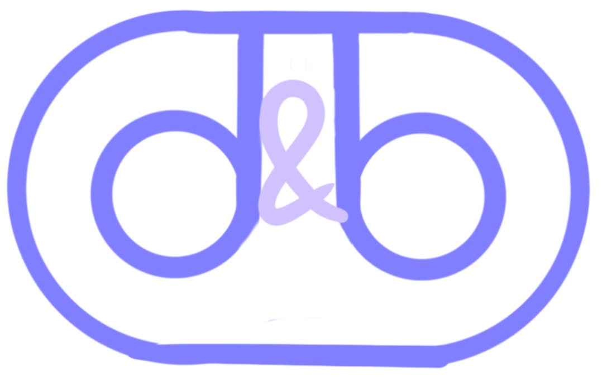
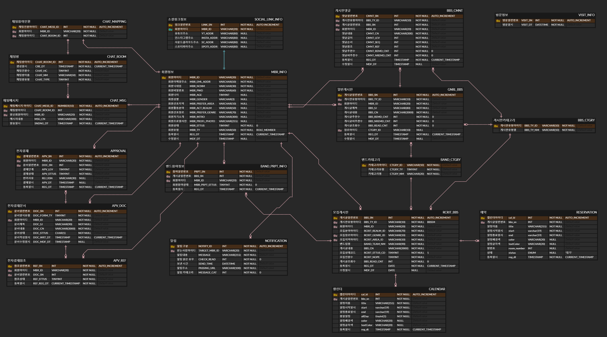

<h1 align="middle">DailyBand</h1>
<h3 align="middle">실시간 음악 밴드 업무 공유 협업 플랫폼</h3>

 

##  🖥️ 프로젝트 소개

>음악 밴드 관련 툴을 이용하고 싶은 사람들을 위해 **모집**부터 **밴드 관리**를 하여 원활한 밴드 활동에 도움을 주고,  
> 팀원 간 **밴드 일정** 공유 및 실시간 **채팅**, **알림**, **합주실 예약**, 
> **전자결재**까지 가능한 실시간 음악 밴드 업무 공유 협업 플랫폼입니다.

## 🗓️ 프로젝트 기간 
- 기획 : 24.05.02 ~ 
- 개발 : 24.05.17 ~ 24.07.01

## 🧑‍🤝‍🧑팀원 구성

| 이름  |  역할   | 담당 기능                                                                                |                                        
|:---:|:-----:|:-------------------------------------------------------------------------------------|
| 김도연 |  팀장   | 내 프로필 정보, 내 게시글, 상대 프로필 정보, 관리(대시보드, 회원 관리,  밴드원 모집 관리, 커뮤니티 관리, 합주실 예약 관리, 전자결재) |
| 변만수 |  팀원   | 로그인, 회원가입, 아이디/비밀번호 찾기, 비밀번호 변경, 합주실 정보, 알림                                          |
| 윤찬영 |  팀원   | 커뮤니티(음악/자유/Q&A/영상 게시판), 밴드 일정,  합주실 예약                                               |
| 홍창민 |  팀원   | 밴드원 모집 게시판, 밴드 관리, 회원 정보 수정, 채팅,  Jasypt 암호화, AWS배포, AWS S3, CK editor 연동         |

## ⚙️ 개발 환경

### OS

### IDE

### DB

## 🔨사용 기술

### Frontend

 

### Backend

### Build Tool

### Infra

 

### Communication

## ERD 

